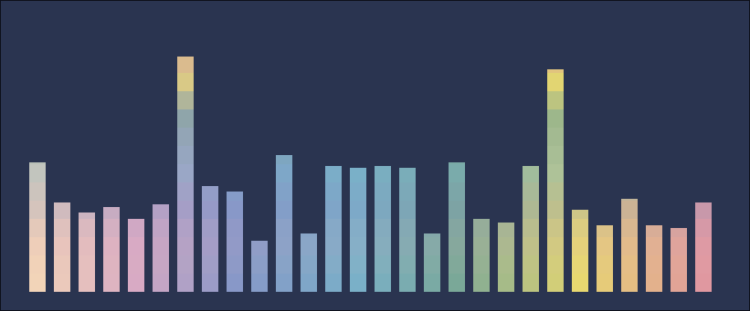
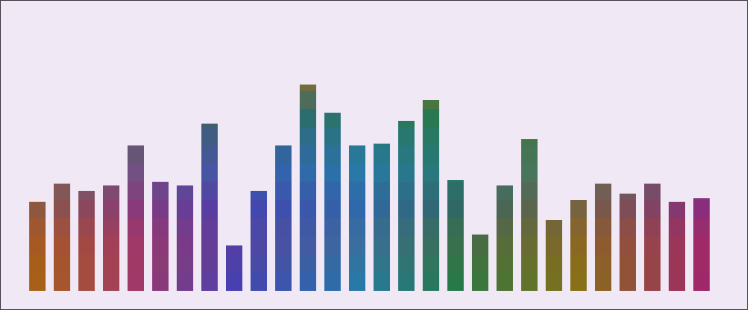

<div align="center">


# 夜桜 Yozakura — cava Theme

A handcrafted pastel color palette for [cava](https://github.com/karlstav/cava), based on the [Yozakura](https://shunsui18.github.io/yozakura) palette.

[](LICENSE)
[](https://github.com/karlstav/cava)
[](install.sh)
[](https://github.com/shunsui18/yozakura)

</div>

---

## ✦ Flavors

| | Flavor | Description |
|---|---|---|
| 🌸 | **Yoru** *(night)* | Deep, moonlit background with soft sakura accents — default |
| ☀️ | **Hiru** *(day)* | Warm ivory canvas with gentle pastel tones |

<br>

<table>
<tr>
<td align="center"><b>🌸 Yoru</b></td>
<td align="center"><b>☀️ Hiru</b></td>
</tr>
<tr>
<td></td>
<td></td>
</tr>
</table>

---

## ✦ Installation

### Interactive — One-liner

Run without any arguments to launch the guided menu:

```bash
bash <(curl -fsSL https://raw.githubusercontent.com/shunsui18/cava/main/install.sh)
```

The installer will walk you through picking a flavor:

```
  夜桜 · Yozakura — cava theme installer
  ──────────────────────────────────────

  Choose a flavor:

   1)  yoru
   2)  hiru

  Enter number [1-2]: _
```

---

### Non-interactive — Flag

Skip the menu entirely by passing the flavor directly:

```bash
bash <(curl -fsSL https://raw.githubusercontent.com/shunsui18/cava/main/install.sh) --theme hiru
```

| Flag | Values | Description |
|---|---|---|
| `--theme` | `yoru` \| `hiru` | Theme flavor to activate |
| `-h`, `--help` | — | Show help and list available flavors |

---

### Manual Installation

If you prefer to clone and run locally:

```bash
# 1. Clone the repo
git clone https://github.com/shunsui18/cava.git && cd cava

# 2a. Interactive
./install.sh

# 2b. Or with a flag
./install.sh --theme hiru
```

---

## ✦ What the Installer Does

1. **Menu or flag** — launches an interactive prompt if no arguments are given, or skips straight to install when `--theme` is provided
2. **Self-locates** — resolves its own path regardless of where it is called from or whether it is symlinked
3. **Validates** — confirms the requested theme file exists before touching anything
4. **Copies** all `yozakura-*` theme files into `$HOME/.config/cava/themes/`, creating the directory if needed
5. **Patches** `$HOME/.config/cava/config`:
   - Comments out every active line in the existing `[color]` block
   - Injects `theme = 'yozakura-<flavor>'` at the top of the `[color]` block
   - Appends a `[color]` block if one is not present in the config at all
   - Creates a backup at `config.bak` before making any changes
6. **Fails gracefully** — descriptive error messages if arguments are invalid or a theme file is not found

> **Note:** cava must have been launched at least once so that `$HOME/.config/cava/config` exists before running the installer.

---

## ✦ File Structure

```
cava/
├── assets/
│   ├── yozakura-yoru-cava-preview.png
│   └── yozakura-hiru-cava-preview.png
├── themes/
│   ├── yozakura-yoru
│   └── yozakura-hiru
├── install.sh
├── LICENSE
└── README.md
```

---

<div align="center">

crafted with 🌸 by [shunsui18](https://github.com/shunsui18)

</div>
